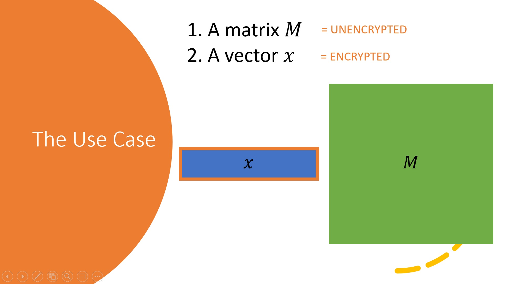

----
# Applications of `matmul`
In this tutorial, we will walk through some applications of the highly optimised `matmul` functionality which is implemented in HElib. We assume familiarity with the basics of CKKS of HElib: for a recap, we refer to the CKKS tutorial.
## The `matmul` Use Case
The `matmul` code can be used when we have an *encrypted* row vector which we want to multiply by an *unencrypted* matrix. 

As we shall see, this setup corresponds to a variety of real world applications.

Let's consider how we might compute an encrypted row vector and unencrypted matrix product homomorphically. Observe that the output of this product is another row vector, with entries given by the dot products of the input vector and the *columns* of the matrix.

We will evaluate each method according to a variety of metrics: the number of input ciphertexts, the number of output ciphertexts, and the number of rotations (which roughly corresponds to the runtime, as rotations dominate other homomorphic operations in this context). We will assume the matrix is $d \times d$: for a more detailed discussion on these methods for rectangular matrices, we refer to [3], which looks at similar considerations for encrypted column vectors.

One approach might pack each of the columns of the matrix into a different plaintext. Then we would evaluate the product by evaluating d inner products, each of which requires $\log(d)$ rotations [1], so that our final complexity is given by $d\log(d)$. Unfortunately, packing each column separately results in having one ciphertext per output entry, giving d ciphertexts in the output.

We could alternatively pack each row into a different plaintext. In this approach, each entry of the input vector needs to be multiplied through by one plaintext only, and all the resulting ciphertexts need to be added up. This method requires each entry of the input in a separate ciphertext, but requires zero rotations and outputs only one ciphertexts.

the `matmul` solution achieves some of the advantages of both methods, and was first presented in [2]. This approach packs *diagonals* into plaintexts, which enables both the input and output to consist of a single ciphertext, and requires d rotations. The number of rotations is reduced further using a babystep-giantstep approach to $O(\sqrt(d))$, and the runtime is further reduced using a technique called hoisting.

![slide2][slides/slide2]

[1] Halevi, S., Shoup, V. (2014). Algorithms in HElib. In: Garay, J.A., Gennaro, R. (eds) Advances in Cryptology – CRYPTO 2014. CRYPTO 2014 
[2] Halevi, S., Shoup, V. (2018). Faster Homomorphic Linear Transformations in HElib. In: Shacham, H., Boldyreva, A. (eds) Advances in Cryptology – CRYPTO 2018. 
[3] Juvekar, Chiraag, Vinod Vaikuntanathan, and Anantha Chandrakasan. "{GAZELLE}: A low latency framework for secure neural network inference." 27th USENIX Security Symposium (USENIX Security 18). 2018.