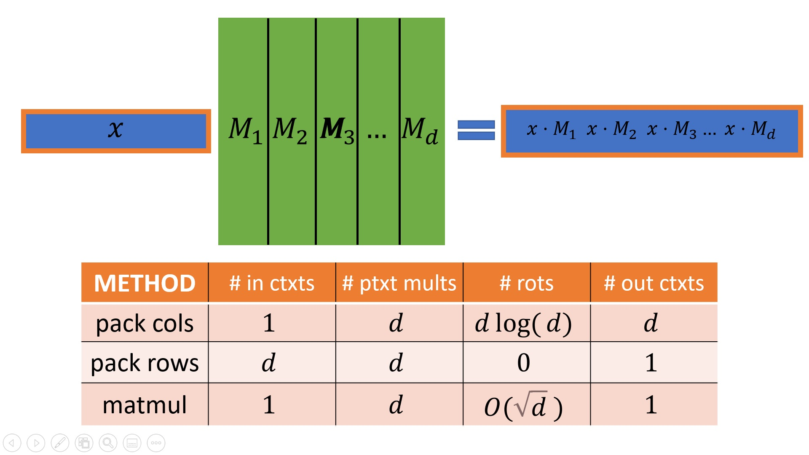
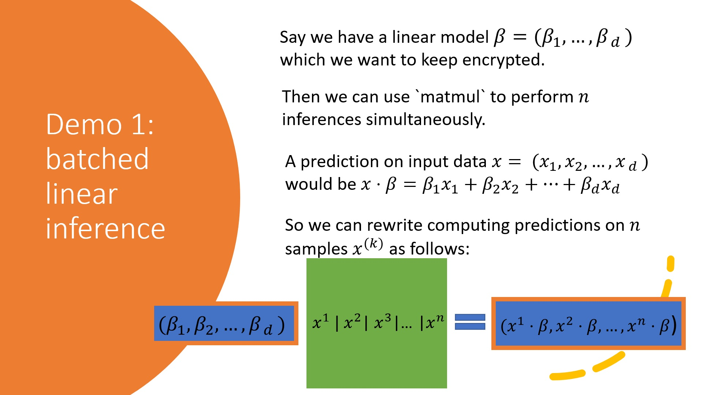
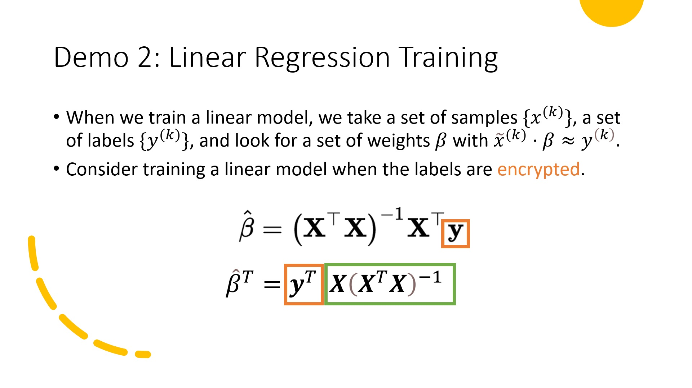
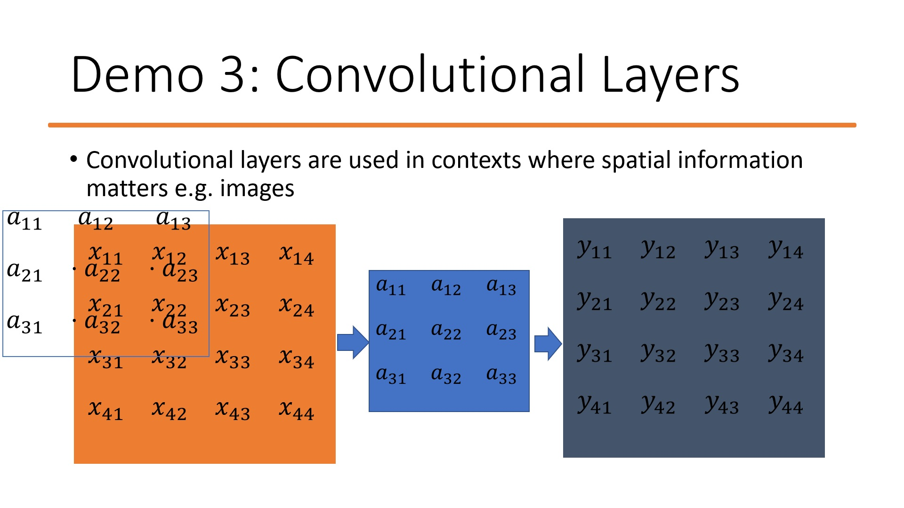
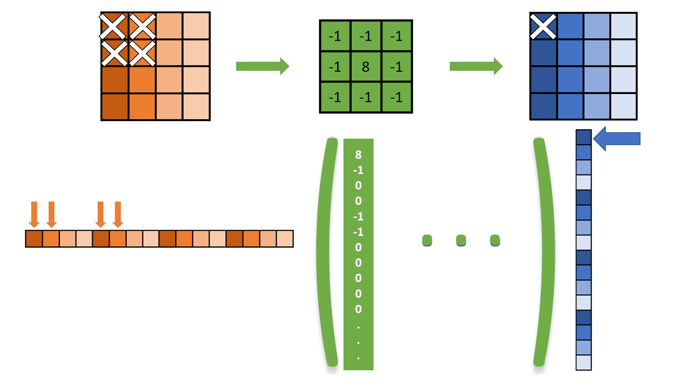

# Applications of `matmul`
In this tutorial, we will walk through some applications of the highly optimised `matmul` functionality which is implemented in HElib. We assume familiarity with the basics of CKKS of HElib: for a recap, we refer to the CKKS tutorial.
## The `matmul` Use Case
The `matmul` code can be used when we have an *encrypted* row vector which we want to multiply by an *unencrypted* matrix. 

As we shall see, this setup corresponds to a variety of real world applications.

Let's consider how we might compute an encrypted row vector and unencrypted matrix product homomorphically. Observe that the output of this product is another row vector, with entries given by the dot products of the input vector and the *columns* of the matrix.

We will evaluate each method according to a variety of metrics: the number of input ciphertexts, the number of output ciphertexts, and the number of rotations (which roughly corresponds to the runtime, as rotations dominate other homomorphic operations in this context). We will assume the matrix is $d \times d$: for a more detailed discussion on these methods for rectangular matrices, we refer to [3], which looks at similar considerations for encrypted column vectors.

One approach might pack each of the columns of the matrix into a different plaintext. Then we would evaluate the product by evaluating d inner products, each of which requires $\log(d)$ rotations [1], so that our final complexity is given by $d\log(d)$. Unfortunately, packing each column separately results in having one ciphertext per output entry, giving d ciphertexts in the output.

We could alternatively pack each row into a different plaintext. In this approach, each entry of the input vector needs to be multiplied through by one plaintext only, and all the resulting ciphertexts need to be added up. This method requires each entry of the input in a separate ciphertext, but requires zero rotations and outputs only one ciphertexts.

the `matmul` solution achieves some of the advantages of both methods, and was first presented in [2]. This approach packs *diagonals* into plaintexts, which enables both the input and output to consist of a single ciphertext, and requires d rotations. The number of rotations is reduced further using a babystep-giantstep approach to $O(\sqrt(d))$, and the runtime is further reduced using a technique called hoisting.

Demo 0 demonstrates the basics of using `matmul` in HElib.

## Batched Linear Inference (demo 1)

Our first application is to using a linear model to perform many predictions in parallel, where we want to keep the model encrypted.

As linear model predictions correspond to dot products between the data and the model, we can achieve this functionality by letting our data form the columns of the plaintext matrix, and the encrypted model form the row vector.

For easy explanation, our model does not have an intercept. This can be addressed either by adding an encrypted intercept after the matrix multiplication, or inserting 1s into the first row of the matrix.

We show how to implement this in demo 1.

## Linear Regression Training (demo 2)
In this example, we want to train a linear model homomorphically, but we want to keep the labels in the training data private. This will output an encrypted model.

If our training samples are given by $k$ vectors $\{x^{(k)}\}$ with labels $\{y^{(k)}\}$, then the weight vector which minimises the quadratic loss is given by $\hat{\beta}=(X^TX)^{-1}X^Ty$, where $X$ has row $k$ given by $(1|x^{(k)})$, and $y$ is a column of the labels.

If we transpose both sides of this equation, we get the best linear model can be calculated $y^TX(X^TX)^{-1}$. As in our example, the matrix $X$ is known in the clear, we can calculate $X(X^TX)^{-1}$ in the clear and then multiply it with our vector of encrypted labels.

The code for this scenario is in demo 2.

## Convolutional Layers (demos 3 and 4)
So far, the examples we have looked at are already in the form of a row vector multiplied by a matrix. However, `matmul` can be useful in many other situations: the trick is to know how to represent the desired transformation in matrix form.

In this demo, we consider passing encrypted data through a convolutional layer which is known in the clear.

A convolutional layer passes a filter (the matrix $a$ in the slide) over a 2 dimensional input image (the matrix $x$) to produce a 2 dimension output image (the matrix $y$).

The each pixel of the output is computed by taking an entry wise product of the filter with the image and adding up all the resulting numbers. For example, in this slide, entry $y_{11}$ is computed by centering the filter on entry $x_{11}$ and computing $x_{11}a_{22}+x_{12}a_{23}+x_{21}a_{32}+x_{22}a_{33}$.

To encode this layer into a plaintext matrix, we first observe that column $j$ of the matrix determines which entries of the input are present in entry $j$ of the output. So, for the above example, in the column with the same index as output entry $y_{11}$, we only want non zero entries in the indices corresponding to $x_{11}$, $x_{12}$, $x_{21}$, and $x_{22}$. Working out what these indices are can be challenging, not least because we need our input $x$ to be in the form of a row vector, not an array.

The code for demo 3 walks through constructing this filter as a matrix when the image is encoded by concatenating rows. The following diagram shows how the first column should be constructed for the filter used in the demo.

The upper half illustrates what is happening for the images, while the lower half translates this to row vectors and matrices. Orange is for the encrypted input, green is for the filter and its corresponding matrix, and blue is for the output. The output vector is shown as a column rather than a row for space reasons.

To choose the entries for the first column, we first realise this corresponds to the entry in the top left entry of the output image. Passing this entry back through the filter, we observe this entry comes from the four entries in the top left, with $8\times$ the corner entry, and $-1\times$ the other three. These entries correspond to the indicated entries of the input in vector form, and so we can construct the first column to select these entries with the correct multipliers.

Demo 4 is similar to demo 3, but considers the additional challenge of applying the filter with no padding.

## References
[1] Halevi, S., Shoup, V. (2014). Algorithms in HElib. In: Garay, J.A., Gennaro, R. (eds) Advances in Cryptology – CRYPTO 2014. CRYPTO 2014 

[2] Halevi, S., Shoup, V. (2018). Faster Homomorphic Linear Transformations in HElib. In: Shacham, H., Boldyreva, A. (eds) Advances in Cryptology – CRYPTO 2018. 

[3] Juvekar, Chiraag, Vinod Vaikuntanathan, and Anantha Chandrakasan. "{GAZELLE}: A low latency framework for secure neural network inference." 27th USENIX Security Symposium (USENIX Security 18). 2018.